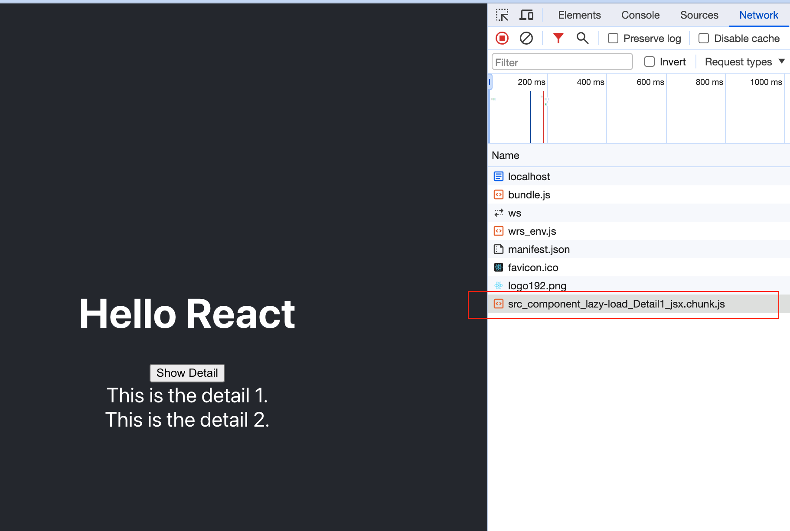

### Lazy Load

```js
<>
  <button onClick={showLazyComponent}>Lazy Detail</button>
  {toggle && (
    <Suspense fallback={<div>Loading...</div>}>
      <Detail1 />
    </Suspense>
  )}
  {toggle && <Detail2 />}
</>
```

- When load the first time, both `Detail1` and `Detail2` is not show yet - until user click `Lazy Detail` button.
- However, the different is `Detail2` code is ready include in the `bundle.js` (that is already download in the application first start), while `Detail1` code is separated into another file `src_component_lazy-load_Detail_jsx.chunk.js` that is not downloaded yet in the first start.
- After user clicks the button to show the detail, `Detail1` is needed to render, so `Detail1` is downloaded from server, while `Detail2` code is already in client side.


